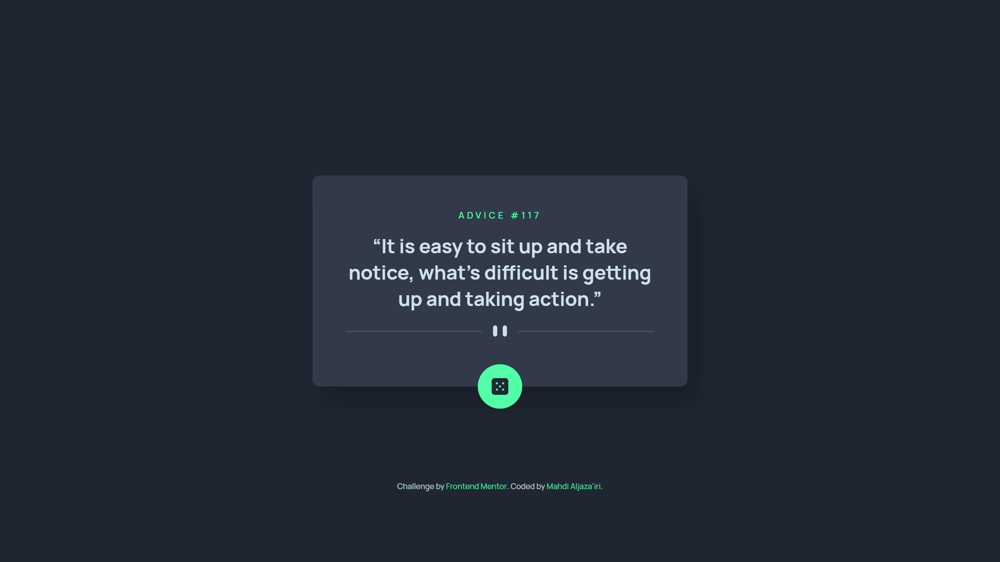
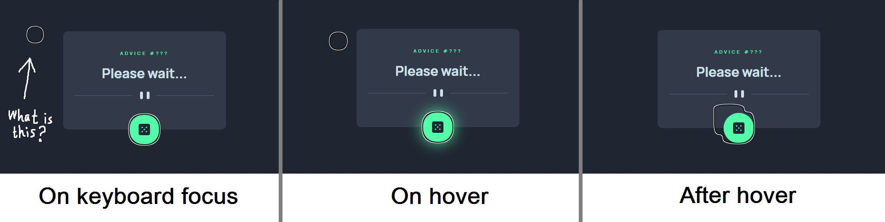

# Frontend Mentor - Advice generator app solution

This is a solution to the [Advice generator app challenge on Frontend Mentor](https://www.frontendmentor.io/challenges/advice-generator-app-QdUG-13db).  
Frontend Mentor challenges help you improve your coding skills by building realistic projects.

\*Me\* : I agree 👍

## Table of contents

- [Overview](#overview)
  - [The challenge](#the-challenge)
  - [Screenshot](#screenshot)
  - [Links](#links)
- [My process](#my-process)
  - [What I learned](#what-i-learned)
  - [Something strange happened](#something-strange-happened)
- [Tools](#tools)
- [Author](#author)

## Overview

### The challenge

Users should be able to:

- View the optimal layout for the app depending on their device's screen size
- See hover states for all interactive elements on the page
- Generate a new piece of advice by clicking the dice icon

### Screenshot



### Links

- Solution URL: <https://www.frontendmentor.io/solutions/dont-drink-bleach-advice-224-nPYiRKeNTk>
- Live Site URL: <https://advice-generator-app-solution-1234.netlify.app>

## My process

### What I learned

Don't be restrained to the style-guide. Sometimes you just need to trust your eyes.

By the way, I'm no longer afraid of dealing with async/await stuff!

### Something strange happened

At the beginnig I wanted to do the button neon glow thing using "`transform: scale()`" on the pseudo-elements:

```css
#dice {
  /* statements */
  z-index: 0;
  /* statements */
}

#dice::before {
  /* statements */
  z-index: -100;
  box-shadow: 0 0 2rem #52ffa8;
  transform: scale(.5);
  transition: transform 300ms ease-out;
}

#dice:hover::before {
  transform: scale(1);
}
```

The effect was great and I was realy happy with it. But, when I tested keyboard focus, the ring on the dice button looked weird! As if there was another instance of the button floating to the left. Then it gets even more distorted when I hover over it and move the cursor away.



Eventually, unfortunately, I resolved to use "`opacity`" instead. Which still looks nice. And the focus ring issue has gone.

I have tested the effect so far on Firefox and Opera, and none of them had any problems.  
I also tested it on IE11, where it didn't even work 😓.

The bug seems to be on Chrome only. I hope it somehow gets fixed.

## Tools

- [Dev Docs](https://devdocs.io) - The resource I was constantly referring to throughout the process. It's an offline web app that has a huge collection of documentations.
- [Brackets](https://brackets.io) - My text editor. Not as powerful as VSCode, but still my favorite.
- Chrome - This web page was only tested on Chrome. Except the focus ring issue, as discussed above.

## Author

- GitHub - [Mahdi Aljaza'iri](https://github.com/MahdiAljazairi)
- Frontend Mentor - [@MahdiAljazairi](https://www.frontendmentor.io/profile/MahdiAljazairi)
